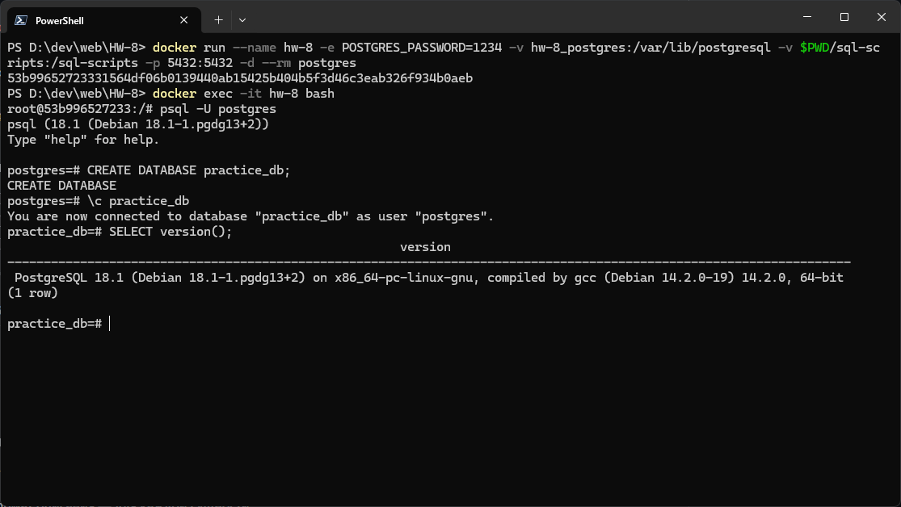
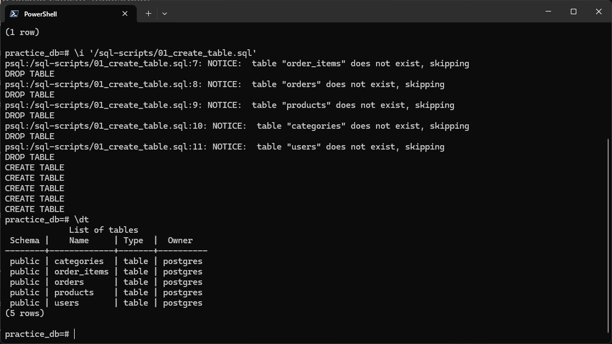
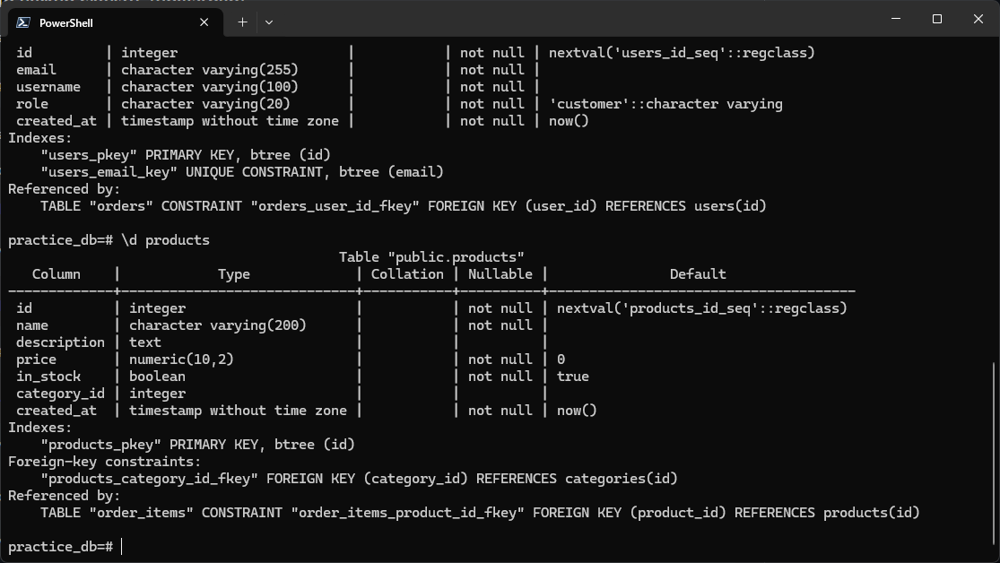
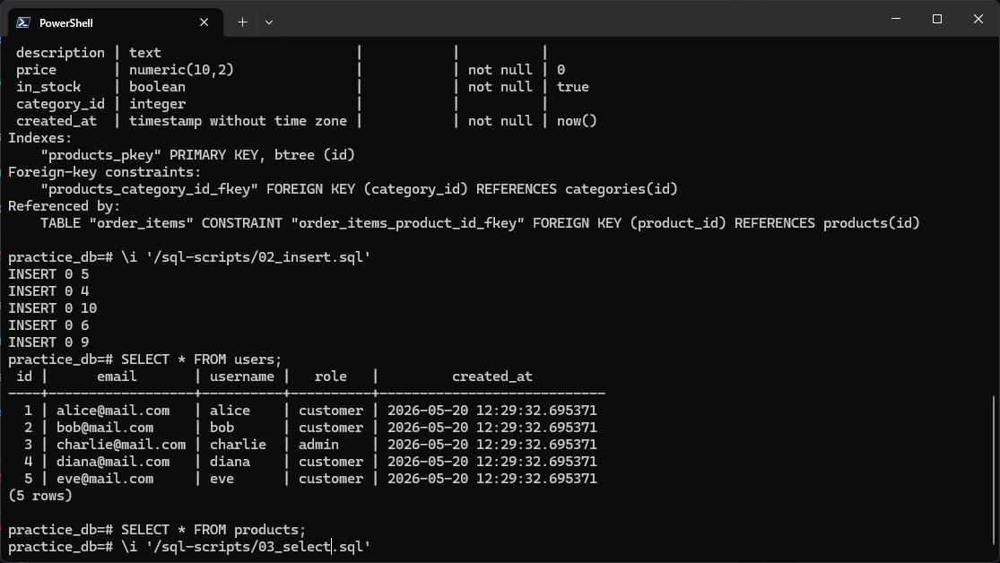
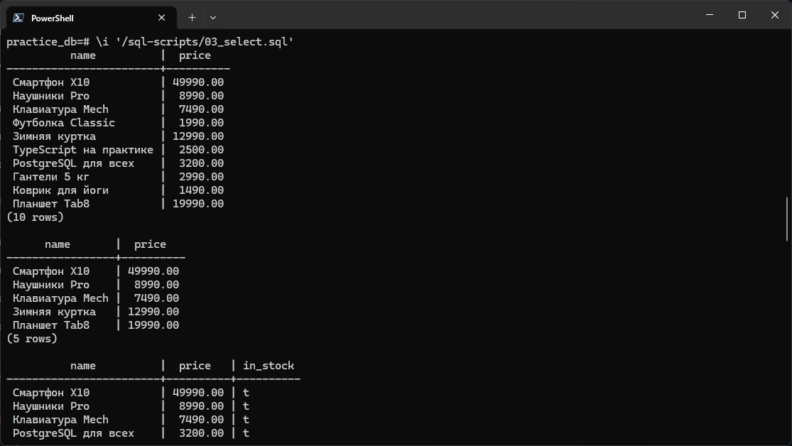
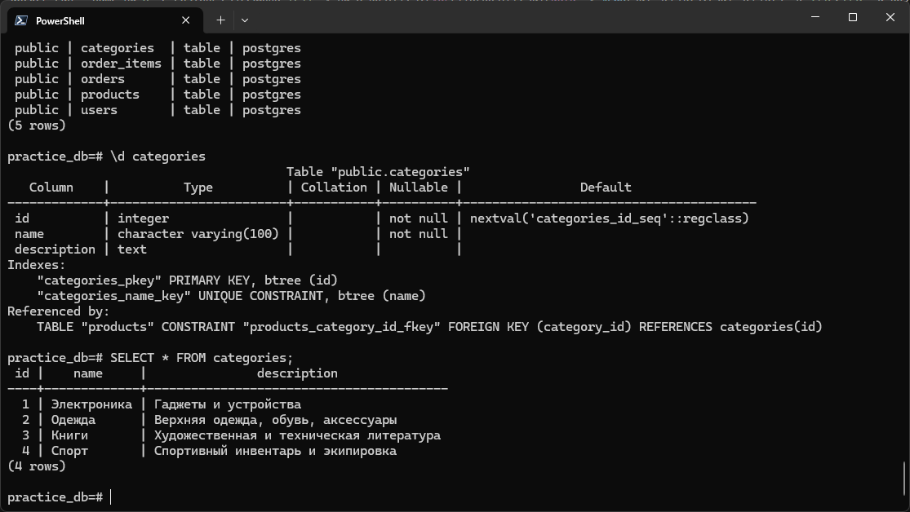
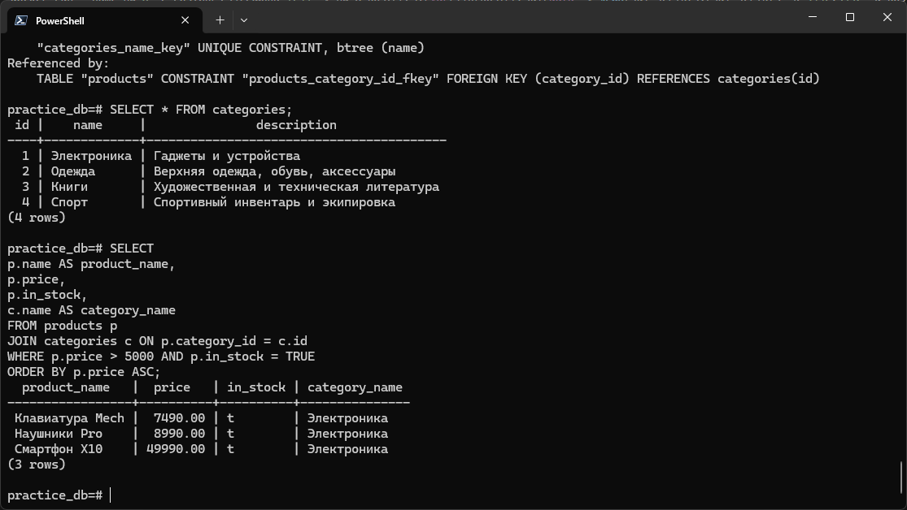
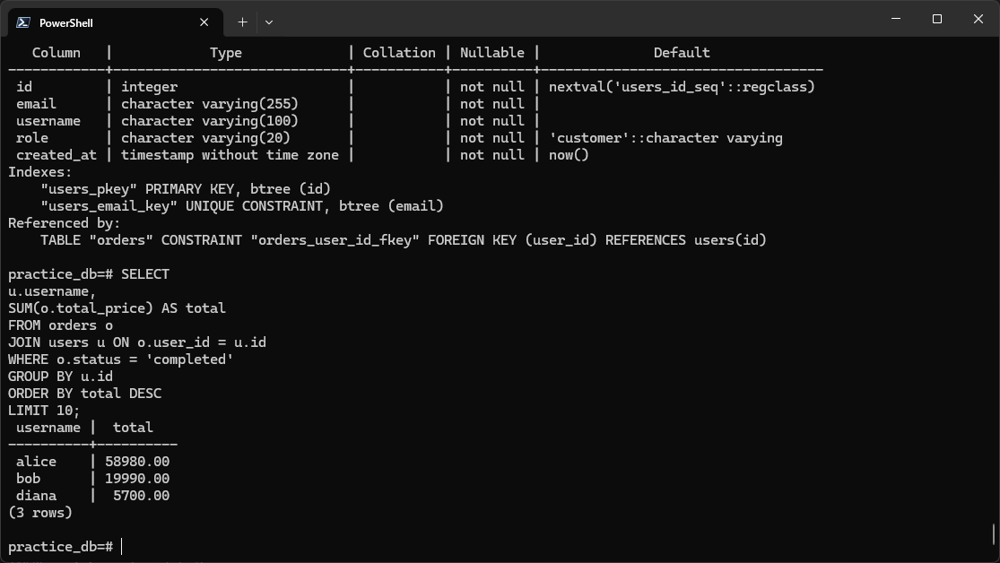

# Домашнее задание #8: SQL — Основы работы с базой данных

В [entities.md](entities.md) описание сущностей итогового проекта и ответы на вопросы ДЗ.

## Задание

### SELECT version();



### Создание таблиц (`01_create_table.sql`)



### Описание созданных таблиц



### Добавление данных (`02_insert.sql`)



### Результаты SELECT-запросов (`03_select.sql`)



## Запросы в БД

### Получить все записи из таблицы `categories`:

```sql
SELECT * FROM categories;
```



### Вывести товары (название, цена, наличие, категория) в наличии и ценой больше 5000, сортировка по возрастанию цены:

```sql
SELECT
    p.name AS product_name,
    p.price,
    p.in_stock,
    c.name AS category_name
FROM products p
JOIN categories c ON p.category_id = c.id
WHERE p.price > 5000 AND p.in_stock = TRUE
ORDER BY p.price ASC;
```



### Вывести 10 пользователей с наибольшей суммой завершенных заказов:

```sql
SELECT
    u.username,
    SUM(o.total_price) AS total
FROM orders o
JOIN users u ON o.user_id = u.id
WHERE o.status = 'completed'
GROUP BY u.id
ORDER BY total DESC
LIMIT 10;
```


