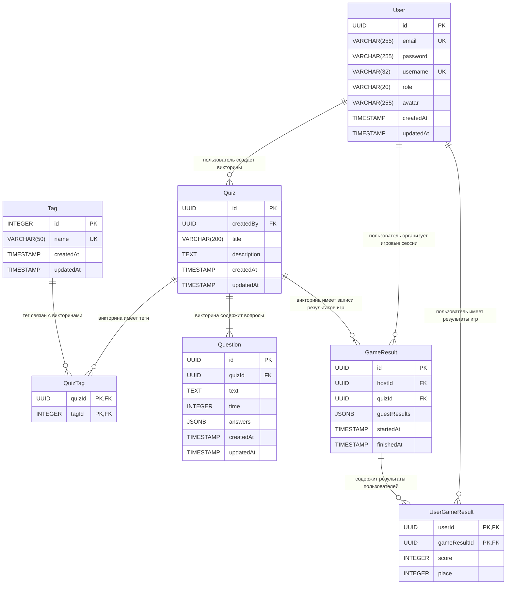

# ER-диаграмма проекта QuizLink

## Диаграмма

## Описание связей

| Связь                       | Тип | Описание                                                                                                                            |
| --------------------------- | --- | ----------------------------------------------------------------------------------------------------------------------------------- |
| User → Quiz                 | 1:N | Один пользователь может создать много викторин                                                                                      |
| Quiz → Question             | 1:N | Одна викторина содержит несколько вопросов                                                                                          |
| Quiz → QuizTag              | 1:N | Одна викторина имеет несколько тегов                                                                                                |
| Tag → QuizTag               | 1:N | Один тег может быть связан со многими викторинами                                                                                   |
| Quiz ↔ Tag                  | M:N | Через промежуточную таблицу `QuizTag` — викторина имеет много тегов, тег связан со многими викторинами                              |
| User → GameResult           | 1:N | Один пользователь может являться организатором многих игровых сессий, результаты которых находятся в `GameResult`                   |
| Quiz → GameResult           | 1:N | Одна викторина может иметь много записей результатов игр                                                                            |
| User → UserGameResult       | 1:N | У одного пользователя может быть много личных результатов игр                                                                       |
| GameResult → UserGameResult | 1:N | Одна запись результата игры содержит много результатов пользователей                                                                |
| User ↔ GameResult           | M:N | Через промежуточную таблицу `UserGameResult` — пользователь имеет много пройденных игр, пройденная игра есть у многих пользователей |

## Ответы на вопросы

### 1. Чем связь 1:N отличается от M:N? Приведите пример каждой из вашего проекта.

**1:N** – один ко многим, запись из первой таблицы связана со множеством из второй, запись из второй – только с одной из первой.

Например, Quiz → Question – одна викторина может содержать несколько вопросов, но вопрос может принадлежать только одной викторине.

**M:N** – многие ко многим, запись из первой таблицы связана со множеством из второй, запись из второй – со множеством из первой.

Например, Quiz ↔ Tag – у одной викторины много тегов, тег связан со многими викторинами.

### 2. Почему связь M:N нельзя реализовать двумя таблицами? Зачем нужна промежуточная?

В реляционной БД внешний ключ может ссылаться только на один первичный ключ. В промежуточной таблице хранятся комбинации из двух внешних ключей, которые связывают записи из двух таблиц между собой.

### 3. Что будет, если удалить запись, на которую ссылается FK? (Подумайте, мы разберём это на лекции)

Зависит от ограничения, установленного при создании внешнего ключа:

- **RESTRICT** – БД выдаст ошибку и не удалит запись.
- **CASCADE** – запись, на которую ссылается FK, удалится, текущая запись также удалится.
- **SET NULL** – запись, на которую ссылается FK, удалится, в поле FK текущей записи будет установлено значение `NULL`.

### 4. Может ли FK быть NULL? Когда это полезно?

FK может быть `NULL`. Полезно, если сущность может существовать сама по себе, без связи с другой. Например, `GameResult.hostId` может быть `NULL`, если игра создавалась неавторизованным пользователем.
